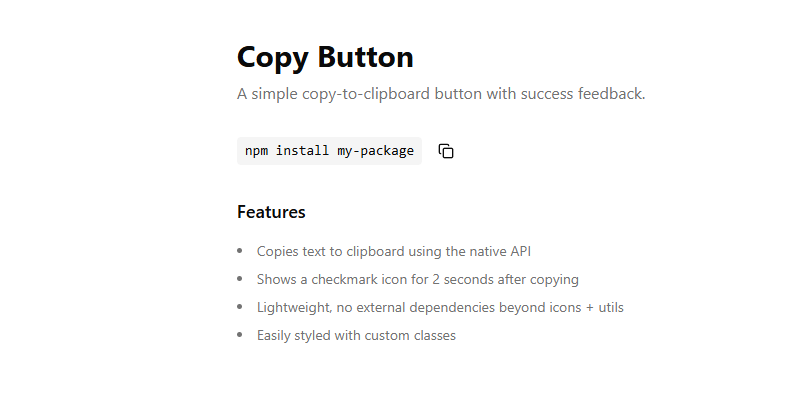

# 📋 CopyButton Component (React + TypeScript)

A lightweight, accessible, and fully typed **copy-to-clipboard button** with visual feedback.

## 🚀 Features

* ⚡ **Instant copy-to-clipboard** using the native Clipboard API
* ✨ **Auto-reset success state** (reverts after 2 seconds)
* 🎨 Fully styleable with **TailwindCSS**
* 🔄 **Animated success state** via icon swap
* 📱 Works in all modern browsers supporting `navigator.clipboard`

---



---

## 📦 Installation

This component uses:

* `lucide-react` for icons
* A `cn` utility for merging class names
* Works seamlessly with Shadcn UI setups

---

## 🛠️ Usage Example

```tsx
import { CopyButton } from "@/components/copy-button"

export default function Demo() {
  return (
    <main className="min-h-screen bg-background p-8">
      <div className="max-w-xl mx-auto space-y-8">
        <div>
          <h1 className="text-3xl font-bold mb-2">Copy Button</h1>
          <p className="text-muted-foreground">
            A simple copy-to-clipboard button with success feedback.
          </p>
        </div>

        <div className="flex items-center gap-4">
          <code className="px-2 py-1 bg-muted rounded text-sm">
            npm install my-package
          </code>
          <CopyButton value="npm install my-package" />
        </div>

        <div className="space-y-4 text-sm">
          <h2 className="text-lg font-semibold">Features</h2>
          <ul className="list-disc list-inside space-y-2 text-muted-foreground">
            <li>Copies text to clipboard using the native API</li>
            <li>Shows a checkmark icon for 2 seconds after copying</li>
            <li>Lightweight, no external dependencies beyond icons + utils</li>
            <li>Easily styled with custom classes</li>
          </ul>
        </div>
      </div>
    </main>
  )
}
```

---

## ⚙️ Props

### `<CopyButton />`

| Prop        | Type                | Description                               |
| ----------- | ------------------- | ----------------------------------------- |
| `value`     | `string`            | The text to copy to the clipboard         |
| `className` | `string` (optional) | Additional classes for styling the button |

---

## 🧩 Behavior Overview

| Feature           | Behavior                                             |
| ----------------- | ---------------------------------------------------- |
| **Copy Action**   | Writes the provided value to the clipboard instantly |
| **Success State** | Shows a green check icon for 2 seconds               |
| **Accessibility** | Includes a visually-hidden label (`sr-only`)         |
| **Styling**       | Fully controlled by passed-in Tailwind classes       |