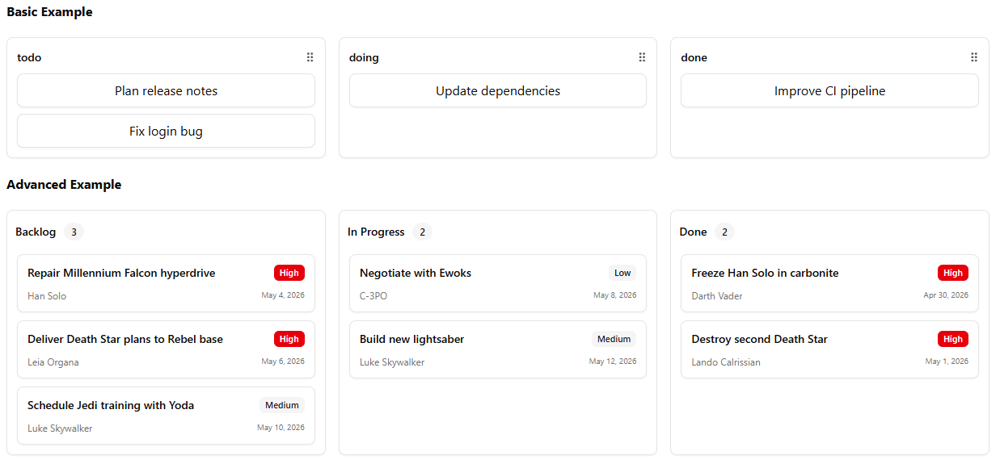

# 🗂️ Advanced Kanban Board Component (React + TypeScript)

A powerful, flexible, fully-controlled **Kanban Board Component System** built with **React**, **TypeScript**, and **@dnd-kit** — featuring:

📦 Controlled external state
🚚 Drag & drop **columns**
🚛 Drag & drop **items**
🔀 Reorder items & columns
🎭 Customizable overlays
🧩 Build-your-own UI with small primitives
🎨 Works seamlessly with TailwindCSS + shadcn/ui

---

## 🚀 Features

* 📦 **Controlled state** via `value` + `onValueChange`
* 🔌 Optional `onMove` callback for handling moves manually
* 🚚 **Drag & drop columns**
* 🚛 **Drag & drop items**
* 🔀 **Reorder items within or across columns**
* 🎭 **Custom drag overlays** for columns & items
* 🧱 Low-level primitives so you can style everything yourself
* 🎨 Tailwind + shadcn/ui friendly by design

---



---

## 📦 Installation

This component uses:

* **@dnd-kit/core**
* **@dnd-kit/sortable**
* **@dnd-kit/modifiers**
* **@dnd-kit/utilities**

---

## 🛠️ Usage Example

```tsx
import React from 'react'
import { Kanban, KanbanBoard, KanbanColumn, KanbanColumnContent, KanbanColumnHandle, KanbanItem, KanbanItemHandle, KanbanOverlay } from './components/kanban-board/kanban-board';
import { Badge } from './components/ui/badge';
import { Button } from './components/ui/button';
import { GripVertical } from 'lucide-react';

interface Task {
  id: string;
  title: string;
  priority: 'low' | 'medium' | 'high';
  description?: string;
  assignee?: string;
  dueDate?: string;
}
const COLUMN_TITLES: Record<string, string> = {
  backlog: 'Backlog',
  inProgress: 'In Progress',
  review: 'Review',
  done: 'Done',
};
interface TaskCardProps {
  task: Task;
  asHandle?: boolean;
}
function TaskCard({ task, asHandle, ...props }: TaskCardProps) {
  const cardContent = (
    <div className="rounded-md border bg-card p-3 shadow-xs">
      <div className="flex flex-col gap-2.5">
        <div className="flex items-center justify-between gap-2">
          <span className="line-clamp-1 font-medium text-sm">{task.title}</span>
          <Badge
            variant={task.priority === 'high' ? 'destructive' : 'secondary'}
            className="pointer-events-none h-5 rounded-sm px-1.5 text-[11px] capitalize shrink-0"
          >
            {task.priority}
          </Badge>
        </div>
        <div className="flex items-center justify-between text-muted-foreground text-xs">
          {task.assignee && (
            <div className="flex items-center gap-1">
              <span className="line-clamp-1">{task.assignee}</span>
            </div>
          )}
          {task.dueDate && <time className="text-[10px] tabular-nums whitespace-nowrap">{task.dueDate}</time>}
        </div>
      </div>
    </div>
  );
  return (
    <KanbanItem value={task.id} {...props}>
      {asHandle ? <KanbanItemHandle>{cardContent}</KanbanItemHandle> : cardContent}
    </KanbanItem>
  );
}
interface TaskColumnProps {
  value: string;
  tasks: Task[];
  isOverlay?: boolean;
}
function TaskColumn({ value, tasks, isOverlay, ...props }: TaskColumnProps) {
  return (
    <KanbanColumn value={value} {...props} className="rounded-md border bg-card p-2.5 shadow-xs">
      <div className="flex items-center justify-between mb-2.5">
        <div className="flex items-center gap-2.5">
          <span className="font-semibold text-sm">{COLUMN_TITLES[value]}</span>
          <Badge variant="secondary">{tasks.length}</Badge>
        </div>
        <KanbanColumnHandle asChild>
          <Button variant="link" size="sm">
            <GripVertical />
          </Button>
        </KanbanColumnHandle>
      </div>
      <KanbanColumnContent value={value} className="flex flex-col gap-2.5 p-0.5">
        {tasks.map((task) => (
          <TaskCard key={task.id} task={task} asHandle={!isOverlay} />
        ))}
      </KanbanColumnContent>
    </KanbanColumn>
  );
}

function BasicExample() {
  const [columns, setColumns] = React.useState<Record<string, { id: string; title: string }[]>>({
    todo: [
      { id: "t1", title: "Plan release notes" },
      { id: "t2", title: "Fix login bug" },
    ],
    doing: [
      { id: "t3", title: "Update dependencies" },
    ],
    done: [
      { id: "t4", title: "Improve CI pipeline" },
    ],
  })

  // Example custom move handler
   const handleMove = React.useCallback((moveEvent: { activeContainer: string; activeIndex: number; overContainer: string; overIndex: number }) => {
    const { activeContainer, activeIndex, overContainer, overIndex } = moveEvent

    console.log("[v0] Task moved:", {
      from: `${activeContainer}[${activeIndex}]`,
      to: `${overContainer}[${overIndex}]`,
    })

    // Manually update state with custom logic
    setColumns((prevColumns) => {
      const activeItems = [...prevColumns[activeContainer]]
      const overItems = activeContainer === overContainer ? activeItems : [...prevColumns[overContainer]]

      const [movedItem] = activeItems.splice(activeIndex, 1)
      overItems.splice(overIndex, 0, movedItem)

      return {
        ...prevColumns,
        [activeContainer]: activeItems,
        [overContainer]: overItems,
      }
    })

    // Here you could also:
    // - Send API request to backend
    // - Show toast notification
    // - Track analytics
    // - Validate the move
  }, [])

  return (
    <Kanban
      value={columns}
      onValueChange={setColumns}
      getItemValue={item => item.id}
      onMove={handleMove}
    >
      <KanbanBoard className="grid auto-rows-fr sm:grid-cols-3 gap-4">
        {Object.entries(columns).map(([col, items]) => (
          <KanbanColumn
            key={col}
            value={col}
            className="rounded-md border bg-card p-3 shadow-xs"
          >
            <div className="flex items-center justify-between mb-2">
              <h2 className="font-semibold text-sm">{col}</h2>
              <KanbanColumnHandle asChild>
                <button className="cursor-grab opacity-70 hover:opacity-100">⠿</button>
              </KanbanColumnHandle>
            </div>

            <KanbanColumnContent value={col}>
              {items.map(item => (
                <KanbanItem
                  key={item.id}
                  value={item.id}
                  className="rounded-md border bg-card p-2 shadow-xs"
                >
                  <KanbanItemHandle asChild>
                    <div className="cursor-grab">{item.title}</div>
                  </KanbanItemHandle>
                </KanbanItem>
              ))}
            </KanbanColumnContent>
          </KanbanColumn>
        ))}
      </KanbanBoard>

      {/* Optional overlay */}
      <KanbanOverlay />
    </Kanban>
  )
}

function AdvancedExample() {
  const [columns, setColumns] = React.useState<Record<string, Task[]>>({
    backlog: [
      {
        id: 'sw1',
        title: 'Repair Millennium Falcon hyperdrive',
        priority: 'high',
        assignee: 'Han Solo',
        dueDate: 'May 4, 2026',
      },
      {
        id: 'sw2',
        title: 'Deliver Death Star plans to Rebel base',
        priority: 'high',
        assignee: 'Leia Organa',
        dueDate: 'May 6, 2026',
      },
      {
        id: 'sw3',
        title: 'Schedule Jedi training with Yoda',
        priority: 'medium',
        assignee: 'Luke Skywalker',
        dueDate: 'May 10, 2026',
      },
    ],
    inProgress: [
      {
        id: 'sw4',
        title: 'Negotiate with Ewoks',
        priority: 'low',
        assignee: 'C-3PO',
        dueDate: 'May 8, 2026',
      },
      {
        id: 'sw5',
        title: 'Build new lightsaber',
        priority: 'medium',
        assignee: 'Luke Skywalker',
        dueDate: 'May 12, 2026',
      },
    ],
    done: [
      {
        id: 'sw6',
        title: 'Freeze Han Solo in carbonite',
        priority: 'high',
        assignee: 'Darth Vader',
        dueDate: 'Apr 30, 2026',
      },
      {
        id: 'sw7',
        title: 'Destroy second Death Star',
        priority: 'high',
        assignee: 'Lando Calrissian',
        dueDate: 'May 1, 2026',
      },
    ],
  });

  return (
    <Kanban 
      value={columns} 
      onValueChange={setColumns} 
      getItemValue={(item) => item.id}
      >
      <KanbanBoard className="grid auto-rows-fr grid-cols-3">
        {Object.entries(columns).map(([columnValue, tasks]) => (
          <TaskColumn key={columnValue} value={columnValue} tasks={tasks} isOverlay={false} />
        ))}
      </KanbanBoard>
      <KanbanOverlay>
        {({ value, variant }) => {
          if (variant === 'column') {
            const tasks = columns[value] ?? [];
            return <TaskColumn value={String(value)} tasks={tasks} isOverlay />;
          }
          const task = Object.values(columns)
            .flat()
            .find((task) => task.id === value);
          if (!task) return null;
          return <TaskCard task={task} />;
        }}
      </KanbanOverlay>
    </Kanban>
  )
}

export default function App() {
  return (
    <div className='flex flex-col gap-5'>
      <h2 className='text-left font-bold'>Basic Example</h2>
      <BasicExample />
      <h2 className='text-left font-bold'>Advanced Example</h2>
      <AdvancedExample />
    </div>
  );
}
```

---

## 🧩 Component Overview

This system provides **small composable building blocks**:

| Component             | Purpose                                |
| --------------------- | -------------------------------------- |
| `Kanban`              | Root provider + drag logic             |
| `KanbanBoard`         | Grid wrapper for columns               |
| `KanbanColumn`        | Sortable column container              |
| `KanbanColumnHandle`  | Drag handle for columns                |
| `KanbanColumnContent` | Sortable list of items inside a column |
| `KanbanItem`          | Draggable item                         |
| `KanbanItemHandle`    | Drag handle for items                  |
| `KanbanOverlay`       | Custom overlay for dragging            |

---

## 💡 Props & Behavior

### `Kanban`

| Prop            | Description                          |
| --------------- | ------------------------------------ |
| `value`         | Record of columnId → item array      |
| `onValueChange` | Called automatically on drag changes |
| `getItemValue`  | Returns the unique item ID           |
| `onMove`        | (Optional) Manual move handler       |

### Movement Logic

| Case                         | Behavior                          |
| ---------------------------- | --------------------------------- |
| Drag item within same column | Items reordered                   |
| Drag item across columns     | Items moved                       |
| Drag column                  | Columns reordered                 |
| `onMove` provided            | You control all movement manually |

---

## 🎭 Custom Drag Overlay

Your overlay can fully mirror the dragged item or column:

```tsx
<KanbanOverlay>
  {({ value, variant }) => (
    variant === "column"
      ? <MyColumnPreview id={value} />
      : <MyItemPreview id={value} />
  )}
</KanbanOverlay>
```

---

## ⌨️ Interactions & Flow

| Action             | Interaction                 |
| ------------------ | --------------------------- |
| 🚚 Move column     | Drag the column handle      |
| 🚛 Move item       | Drag the item or its handle |
| 🔀 Reorder items   | Drag item up/down           |
| 🔁 Reorder columns | Drag column left/right      |

| 🎭 Custom overlays | Provide function children   |
