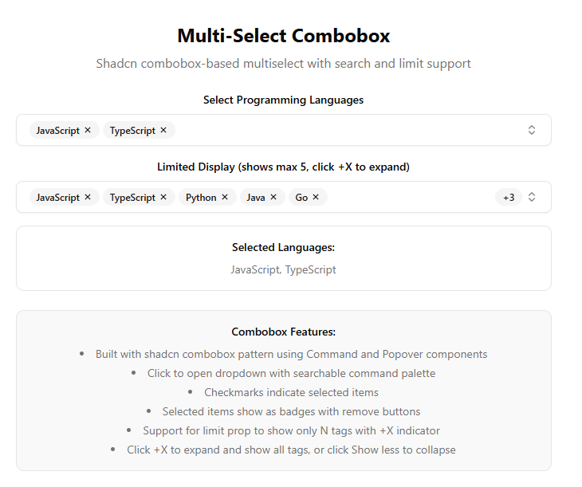

# 🎯 Multi-Select Combobox (React + TypeScript)

A powerful and flexible **multi-select dropdown**

---

## 🚀 Features

* 🔍 **Searchable** dropdown powered by the shadcn `Command` component
* 🏷️ **Badges** for selected items, each with a remove button
* ✔️ **Checkmarks** for selected options inside the dropdown
* ➕ **Multi-select** via click or keyboard navigation
* 📉 Optional **limit** prop to show only N tags with `+X` overflow
* 📤 Fully controlled `value` + `onChange`
* 🎨 Styled with shadcn/ui and TailwindCSS, drop-in compatible

---



---

## 📦 Installation

Uses components from: [Shadcn UI library](https://ui.shadcn.com)

---

## 🛠️ Usage Example

```tsx
import { MultiSelectCombobox } from "./multi-select-combobox"

export default function Demo() {
  const [selectedLanguages, setSelectedLanguages] = React.useState<string[]>(["javascript", "typescript"])
  const [limitedLanguages, setLimitedLanguages] = React.useState<string[]>([
    "javascript",
    "typescript",
    "python",
    "java",
    "go",
    "rust",
    "cpp",
    "csharp",
  ])

  const languageOptions = [
    { value: "javascript", label: "JavaScript" },
    { value: "typescript", label: "TypeScript" },
    { value: "python", label: "Python" },
    { value: "java", label: "Java" },
    { value: "go", label: "Go" },
    { value: "rust", label: "Rust" },
    { value: "cpp", label: "C++" },
    { value: "csharp", label: "C#" },
    { value: "ruby", label: "Ruby" },
    { value: "php", label: "PHP" },
  ]

  return (
    <main className="flex min-h-screen flex-col items-center justify-center p-8 bg-background">
      <div className="w-full max-w-2xl space-y-6">
        <div className="space-y-2 pt-8 border-t border-border">
          <h2 className="text-2xl font-bold text-foreground">Multi-Select Combobox</h2>
          <p className="text-muted-foreground">Shadcn combobox-based multiselect with search and limit support</p>
        </div>

        <div className="space-y-4">
          <div>
            <label className="text-sm font-medium text-foreground mb-2 block">Select Programming Languages</label>
            <MultiSelectCombobox
              options={languageOptions}
              value={selectedLanguages}
              onChange={setSelectedLanguages}
              placeholder="Select languages..."
            />
          </div>

          <div>
            <label className="text-sm font-medium text-foreground mb-2 block">
              Limited Display (shows max 5, click +X to expand)
            </label>
            <MultiSelectCombobox
              options={languageOptions}
              value={limitedLanguages}
              onChange={setLimitedLanguages}
              placeholder="Select languages..."
              limit={5}
            />
          </div>

          <div className="rounded-lg border border-border bg-card p-4">
            <h3 className="text-sm font-semibold text-card-foreground mb-2">Selected Languages:</h3>
            <p className="text-sm text-muted-foreground">
              {selectedLanguages.length > 0
                ? selectedLanguages.map((v) => languageOptions.find((o) => o.value === v)?.label).join(", ")
                : "No languages selected"}
            </p>
          </div>

          <div className="rounded-lg border border-border bg-card p-4">
            <h3 className="text-sm font-semibold text-card-foreground mb-2">Limited Languages:</h3>
            <p className="text-sm text-muted-foreground">
              {limitedLanguages.length > 0
                ? limitedLanguages.map((v) => languageOptions.find((o) => o.value === v)?.label).join(", ")
                : "No languages selected"}
            </p>
          </div>
        </div>

        <div className="rounded-lg border border-border bg-muted/50 p-4">
          <h3 className="text-sm font-semibold text-foreground mb-2">Combobox Features:</h3>
          <ul className="text-sm text-muted-foreground space-y-1 list-disc list-inside">
            <li>Built with shadcn combobox pattern using Command and Popover components</li>
            <li>Click to open dropdown with searchable command palette</li>
            <li>Checkmarks indicate selected items</li>
            <li>Selected items show as badges with remove buttons</li>
            <li>Support for limit prop to show only N tags with +X indicator</li>
            <li>Click +X to expand and show all tags, or click Show less to collapse</li>
          </ul>
        </div>
      </div>
    </main>
  )
}
```

---

## ⌨️ Keyboard & Interaction Notes

| Action                    | Interaction                |
| ------------------------- | -------------------------- |
| ✔️ Select item            | Click or use **Enter**     |
| ❌ Remove selected tag     | Click the **X** on a badge |
| 🔍 Search options         | Type in the search input   |
| 🔽 Toggle dropdown        | Click the combobox button  |
| ➕ Expand limited tags     | Click **+X**               |
| 📉 Collapse expanded list | Click **Show less**        |
