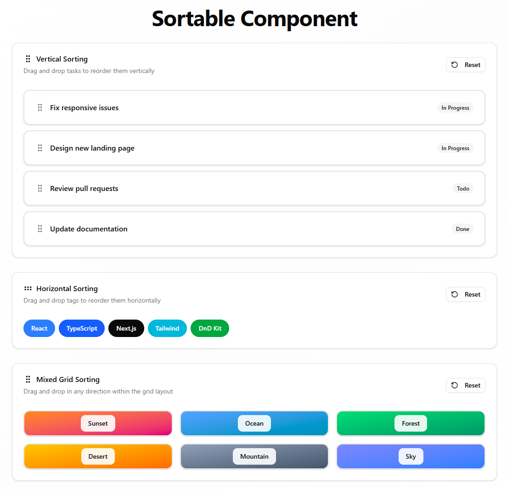

# 🎯 Sortable Component (React + TypeScript)

A flexible, powerful, and fully-typed **drag-and-drop sorting component** built with React, TypeScript, and **@dnd-kit** — featuring:
✨ Vertical sorting
↔️ Horizontal sorting
🧩 Mixed grid sorting
🎨 Beautiful styling (works great with TailwindCSS + shadcn/ui)
⚡ Custom overlay rendering

---

## 🚀 Features

* ↕️ **Vertical** list sorting
* ↔️ **Horizontal** row sorting
* 🧩 **Mixed** free-movement sorting (grid-friendly)
* 🎛️ Fully controlled `items` + `onReorder`
* 🎨 Works seamlessly with TailwindCSS + shadcn/ui
* 🎭 Optional custom drag overlay
* 🧱 `SortableItem` for any custom UI element

---



---

## 📦 Installation

Uses components and utilities from:

* **@dnd-kit/core**
* **@dnd-kit/sortable**
* **@dnd-kit/modifiers**
* **@dnd-kit/utilities**

---

## 🛠️ Usage Example

```tsx
import { useState } from 'react';
import { Badge } from './components/ui/badge';
import { Button } from './components/ui/button';
import { GripVertical, RotateCcw } from 'lucide-react';
import { Sortable, SortableItem } from './components/sortable/sortable';
import { Card, CardContent, CardDescription, CardHeader, CardTitle } from './components/ui/card';

interface Task {
  id: string
  title: string
  status: string
}

interface Tag {
  id: string
  name: string
  color: string
}

interface Photo {
  id: string
  title: string
  color: string
}

const initialTasks: Task[] = [
  { id: "1", title: "Design new landing page", status: "In Progress" },
  { id: "2", title: "Review pull requests", status: "Todo" },
  { id: "3", title: "Update documentation", status: "Done" },
  { id: "4", title: "Fix responsive issues", status: "In Progress" },
]

const initialTags: Tag[] = [
  { id: "1", name: "React", color: "bg-blue-500" },
  { id: "2", name: "TypeScript", color: "bg-blue-600" },
  { id: "3", name: "Next.js", color: "bg-foreground" },
  { id: "4", name: "Tailwind", color: "bg-cyan-500" },
  { id: "5", name: "DnD Kit", color: "bg-green-600" },
]

const initialPhotos: Photo[] = [
  { id: "1", title: "Sunset", color: "from-orange-400 to-pink-600" },
  { id: "2", title: "Ocean", color: "from-blue-400 to-cyan-600" },
  { id: "3", title: "Forest", color: "from-green-400 to-emerald-600" },
  { id: "4", title: "Desert", color: "from-yellow-400 to-orange-500" },
  { id: "5", title: "Mountain", color: "from-slate-400 to-slate-600" },
  { id: "6", title: "Sky", color: "from-indigo-400 to-blue-500" },
]

export default function Page() {
  const [tasks, setTasks] = useState(initialTasks)
  const [tags, setTags] = useState(initialTags)
  const [photos, setPhotos] = useState(initialPhotos)

  return (
    <div className="min-h-screen bg-gradient-to-br from-background via-muted/20 to-background">
      <div className="mx-auto max-w-6xl space-y-8 p-6 md:p-12">
        {/* Header */}
        <div className="space-y-3 text-center">
          <h1 className="text-balance text-4xl font-bold tracking-tight md:text-5xl">Sortable Component</h1>
        </div>

        {/* Vertical Example */}
        <Card>
          <CardHeader>
            <div className="flex items-center justify-between">
              <div className="space-y-1.5">
                <CardTitle className="flex items-center gap-2">
                  <GripVertical className="size-5" />
                  Vertical Sorting
                </CardTitle>
                <CardDescription>Drag and drop tasks to reorder them vertically</CardDescription>
              </div>
              <Button variant="outline" size="sm" onClick={() => setTasks(initialTasks)}>
                <RotateCcw className="mr-2 size-4" />
                Reset
              </Button>
            </div>
          </CardHeader>
          <CardContent>
            <Sortable items={tasks} onReorder={setTasks} orientation="vertical" className="space-y-3">
              {(task) => (
                <SortableItem key={task.id} id={task.id}>
                  <Card className="border-2 transition-colors hover:border-primary/50">
                    <CardContent className="flex items-center justify-between">
                      <div className="flex items-center gap-3">
                        <GripVertical className="size-5 text-muted-foreground" />
                        <span className="font-medium">{task.title}</span>
                      </div>
                      <Badge variant="secondary">{task.status}</Badge>
                    </CardContent>
                  </Card>
                </SortableItem>
              )}
            </Sortable>
          </CardContent>
        </Card>

        {/* Horizontal Example */}
        <Card>
          <CardHeader>
            <div className="flex items-center justify-between">
              <div className="space-y-1.5">
                <CardTitle className="flex items-center gap-2">
                  <GripVertical className="size-5 rotate-90" />
                  Horizontal Sorting
                </CardTitle>
                <CardDescription>Drag and drop tags to reorder them horizontally</CardDescription>
              </div>
              <Button variant="outline" size="sm" onClick={() => setTags(initialTags)}>
                <RotateCcw className="mr-2 size-4" />
                Reset
              </Button>
            </div>
          </CardHeader>
          <CardContent>
            <Sortable items={tags} onReorder={setTags} orientation="horizontal" className="flex flex-wrap gap-2">
              {(tag) => (
                <SortableItem key={tag.id} id={tag.id}>
                  <Badge
                    className={`${tag.color} cursor-grab px-4 py-2 text-sm font-medium text-white transition-transform hover:scale-105 active:cursor-grabbing`}
                  >
                    {tag.name}
                  </Badge>
                </SortableItem>
              )}
            </Sortable>
          </CardContent>
        </Card>

        {/* Mixed Grid Example */}
        <Card>
          <CardHeader>
            <div className="flex items-center justify-between">
              <div className="space-y-1.5">
                <CardTitle className="flex items-center gap-2">
                  <GripVertical className="size-5" />
                  Mixed Grid Sorting
                </CardTitle>
                <CardDescription>Drag and drop in any direction within the grid layout</CardDescription>
              </div>
              <Button variant="outline" size="sm" onClick={() => setPhotos(initialPhotos)}>
                <RotateCcw className="mr-2 size-4" />
                Reset
              </Button>
            </div>
          </CardHeader>
          <CardContent>
            <Sortable
              items={photos}
              onReorder={setPhotos}
              orientation="mixed"
              className="grid grid-cols-2 gap-4 md:grid-cols-3"
            >
              {(photo) => (
                <SortableItem key={photo.id} id={photo.id}>
                  <Card className={`group overflow-hidden border-2 transition-all hover:border-primary/50 hover:shadow-lg py-2 bg-linear-to-br ${photo.color}`}>
                    <div className={`flex items-center justify-center`}>
                      <div className="rounded-lg bg-background/90 px-4 py-2 text-sm font-semibold backdrop-blur-sm">
                        {photo.title}
                      </div>
                    </div>
                  </Card>
                </SortableItem>
              )}
            </Sortable>
          </CardContent>
        </Card>
      </div>
    </div>
  )
}
```

---

## ⚙️ Props

### `<Sortable />`

| Prop            | Type                                    | Description                                 |
| --------------- | --------------------------------------- | ------------------------------------------- |
| `items`         | `T[]`                                   | Array of sortable items (must contain `id`) |
| `onReorder`     | `(items: T[]) => void`                  | Called when items reorder                   |
| `orientation`   | `"vertical" \| "horizontal" \| "mixed"` | Sorting mode (default: `"vertical"`)        |
| `children`      | `(item: T) => ReactNode`                | Render function for each item               |
| `renderOverlay` | `(item: T) => ReactNode` (optional)     | Custom preview while dragging               |
| `className`     | `string` (optional)                     | Wrapper class                               |

---

### `<SortableItem />`

| Prop        | Type                 | Description                    |
| ----------- | -------------------- | ------------------------------ |
| `id`        | `string \| number`   | Unique sortable item ID        |
| `children`  | `ReactNode`          | Content to render              |
| `asChild`   | `boolean` (optional) | Use Radix `<Slot>` wrapper     |
| `className` | `string` (optional)  | CSS classes                    |
| `disabled`  | `boolean` (optional) | Disable dragging for this item |

---

## 🧠 How to Use

* Wrap your data array in `<Sortable />`
* Wrap each rendered element in `<SortableItem />`
* Provide a stable `id` field for each item
* Use `onReorder` to update your sorted array
* Choose `orientation`:

  * `"vertical"` → lists
  * `"horizontal"` → rows
  * `"mixed"` → grids & free movement

---

## 🧩 Orientation Modes

| Mode           | Behavior                             |
| -------------- | ------------------------------------ |
| **Vertical**   | Items reorder top-to-bottom          |
| **Horizontal** | Items reorder left-to-right          |
| **Mixed**      | Grid-style movement in any direction |