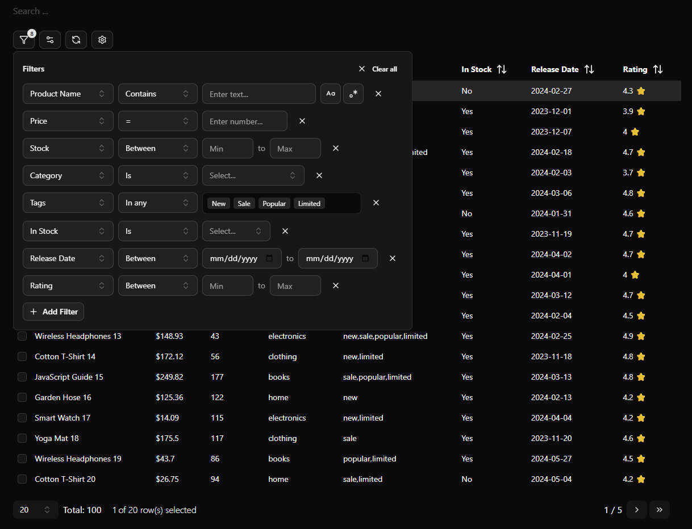

# 🧮 Advanced TanStack Datatable

A flexible, powerful, and fully-typed advanced data table component using [TanStack Table](https://tanstack.com/table/v8)

---

## 🚀 Tech Stack

| 🛠️ Technology   | 🌟 Description              |
|------------------|-----------------------------|
| ⚛️ React       | UI library for building apps |
| 🧑‍💻 TypeScript | Typed superset of JavaScript  |
| 🏗️ Vite        | Fast build tool & dev server |
| 📊 TanStack Table | Headless table logic      |
| 🎨 TailwindCSS | Styling               |
| 🦄 [Shadcn UI library]("https://ui.shadcn.com/) | Reusable components           |

---



---

## 📦 Features

- 🔍 **Global Search**: Instantly filter table data
- 🧩 **Advanced Filtering**: Multi-column, custom logic
- 📑 **Pagination**: Easy navigation through data
- 👁️ **Column Visibility**: Choose which columns to hide
- 🎛️ **Reusable UI Components**: Buttons, inputs, selects, tables
- ⚡ **Fast & Responsive**: Powered by Vite & React
- 📝 **Type-Safe**: Built with TypeScript

---

## 📦 Installation

Uses components and utilities from:

* **@tanstack/react-table**
* **[Shadcn UI Table](https://ui.shadcn.com/docs/components/data-table)**

---

## 🛠️ Usage Example

```tsx
import type { ColumnDef } from "@tanstack/react-table"
import { DataTable } from "./data-table"

type ProductColumn = {
  name: string
  price: number
  stock: number
  category: string
  tags: string
  inStock: boolean
  releaseDate: string
  rating: number
}

const productTableColumns: ColumnDef<ProductColumn>[] = [
  {
    accessorKey: "name",
    header: "Product Name",
    meta: {
      filter_type: "text",
    },
  },
  {
    accessorKey: "price",
    header: "Price",
    meta: {
      filter_type: "number",
    },
    cell: ({ row }) => `$${row.getValue("price")}`,
  },
  {
    accessorKey: "stock",
    header: "Stock",
    meta: {
      filter_type: "range",
    },
  },
  {
    accessorKey: "category",
    header: "Category",
    meta: {
      filter_type: "select",
      options: [
        { label: "Electronics", value: "electronics" },
        { label: "Clothing", value: "clothing" },
        { label: "Books", value: "books" },
        { label: "Home & Garden", value: "home" },
      ],
    },
  },
  {
    accessorKey: "tags",
    header: "Tags",
    meta: {
      filter_type: "multiSelect",
      options: [
        { label: "New", value: "new" },
        { label: "Sale", value: "sale" },
        { label: "Popular", value: "popular" },
        { label: "Limited", value: "limited" },
      ],
    },
  },
  {
    accessorKey: "inStock",
    header: "In Stock",
    meta: {
      filter_type: "boolean",
    },
    cell: ({ row }) => (row.getValue("inStock") ? "Yes" : "No"),
  },
  {
    accessorKey: "releaseDate",
    header: "Release Date",
    meta: {
      filter_type: "dateRange",
    },
  },
  {
    accessorKey: "rating",
    header: "Rating",
    meta: {
      filter_type: "range",
    },
    cell: ({ row }) => `${row.getValue("rating")} ⭐`,
  },
]

const categories = ["electronics", "clothing", "books", "home"];
const tagsList = ["new", "sale", "popular", "limited"];
function randomTags() {
  const tags = [];
  for (let i = 0; i < tagsList.length; i++) {
    if (Math.random() > 0.5) tags.push(tagsList[i]);
  }
  return tags.length ? tags.join(",") : tagsList[Math.floor(Math.random() * tagsList.length)];
}
function randomDate(start: Date, end: Date) {
  return new Date(start.getTime() + Math.random() * (end.getTime() - start.getTime()))
    .toISOString().slice(0, 10);
}
const sampleProducts: ProductColumn[] = Array.from({ length: 100 }, (_, i) => {
  const category = categories[i % categories.length];
  return {
    name: `${["Wireless Headphones", "Cotton T-Shirt", "JavaScript Guide", "Garden Hose", "Smart Watch", "Yoga Mat"][i % 6]} ${i + 1}`,
    price: Number((10 + Math.random() * 240).toFixed(2)),
    stock: Math.floor(Math.random() * 200),
    category,
    tags: randomTags(),
    inStock: Math.random() > 0.2,
    releaseDate: randomDate(new Date(2023, 10, 1), new Date(2024, 4, 30)),
    rating: Number((3.5 + Math.random() * 1.5).toFixed(1)),
  };
});

export default function AdvancedTable() {
  return (
    <div>
      {/* Optional Props
          
          global_search: boolean
          advanced_filter: boolean
          column_visibility: boolean
          initial_page_size: number
      */}
      <DataTable data={sampleProducts} columns={productTableColumns} global_search={true} advanced_filter={true} column_visibility={true} />
    </div>
  )
}
```

---

## 📚 Resources and Inspiration

- [TanStack Table Docs](https://tanstack.com/table/v8)
- [Vite Docs](https://vitejs.dev/)
- [Shadcn](https://ui.shadcn.com/)
- [Dice UI](https://www.diceui.com/docs/components/data-table)
- [Dice UI Table Example](https://tablecn.com/)