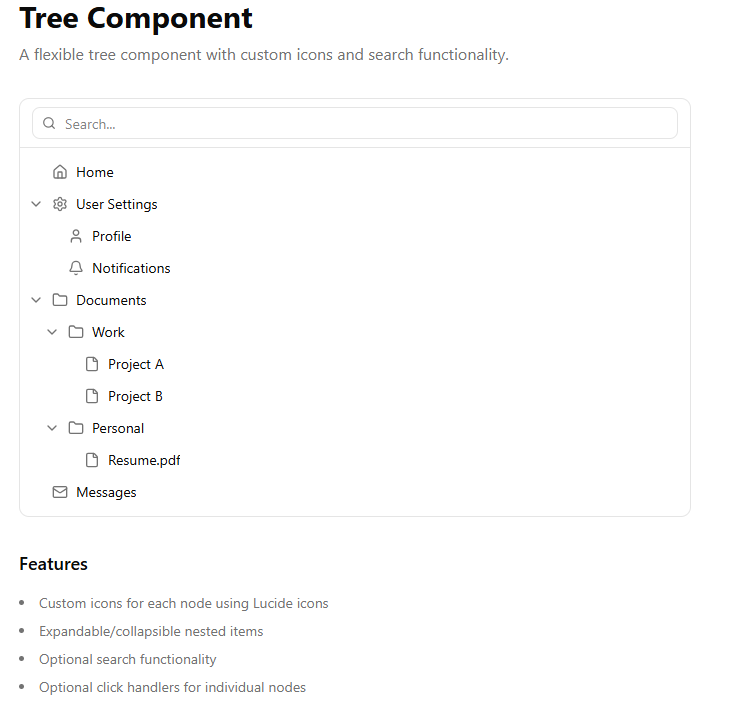

# 🌳 Tree Component (React + TypeScript)

A flexible, accessible, and fully typed **hierarchical tree navigation component** 

## 🚀 Features

* 📂 **Nested tree structure** with unlimited depth
* 🔍 **Search filtering** with auto-expanded matches
* 🖼️ **Custom icons** per node
* 🎛️ Optional `onClick` handlers
* 🎯 Fully controlled + keyboard-friendly
* 🎨 Works beautifully with TailwindCSS + shadcn/ui

---



---

## 📦 Installation

Uses utilities and components from: [Shadcn UI Library](https://ui.shadcn.com)

---

## 🛠️ Usage Example

```tsx
import { Tree, type TreeNode } from "@/components/tree/tree"
import { Folder, File, Home, Settings, User, Mail, Bell } from "lucide-react"

export default function Demo() {
  const treeData: TreeNode[] = [
    {
      name: "Home",
      icon: Home,
      onClick: () => console.log("Home clicked"),
    },
    {
      name: "User Settings",
      icon: Settings,
      children: [
        {
          name: "Profile",
          icon: User,
          onClick: () => console.log("Profile clicked"),
        },
        {
          name: "Notifications",
          icon: Bell,
          onClick: () => console.log("Notifications clicked"),
        },
      ],
    },
    {
      name: "Documents",
      icon: Folder,
      children: [
        {
          name: "Work",
          icon: Folder,
          children: [
            {
              name: "Project A",
              icon: File,
            },
            {
              name: "Project B",
              icon: File,
            },
          ],
        },
        {
          name: "Personal",
          icon: Folder,
          children: [
            {
              name: "Resume.pdf",
              icon: File,
            },
          ],
        },
      ],
    },
    {
      name: "Messages",
      icon: Mail,
      onClick: () => console.log("Messages clicked"),
    },
  ]

  return (
    <main className="min-h-screen bg-background p-8">
      <div className="max-w-2xl mx-auto space-y-8">
        <div>
          <h1 className="text-3xl font-bold mb-2">Tree Component</h1>
          <p className="text-muted-foreground">A flexible tree component with custom icons and search functionality.</p>
        </div>

        <Tree data={treeData} className="max-h-[600px]"/>

        <div className="space-y-4 text-sm">
          <h2 className="text-lg font-semibold">Features</h2>
          <ul className="list-disc list-inside space-y-2 text-muted-foreground">
            <li>Custom icons for each node using Lucide icons</li>
            <li>Expandable/collapsible nested items</li>
            <li>Optional search functionality</li>
            <li>Optional click handlers for individual nodes</li>
          </ul>
        </div>
      </div>
    </main>
  )
}
```

---

## ⚙️ Props

### `<Tree />`

| Prop         | Type                 | Description                                   |
| ------------ | -------------------- | --------------------------------------------- |
| `data`       | `TreeNode[]`         | Array of nodes to render                      |
| `className`  | `string` (optional)  | Additional wrapper classes                    |
| `showSearch` | `boolean` (optional) | Toggles built-in search bar (default: `true`) |

---

### `TreeNode`

| Field      | Type                    | Description                               |
| ---------- | ----------------------- | ----------------------------------------- |
| `name`     | `string`                | Display label                             |
| `icon`     | `React.ComponentType<React.SVGProps<SVGSVGElement>>` (optional) | Icon component to render                  |
| `children` | `TreeNode[]` (optional) | Optional nested items                     |
| `onClick`  | `() => void` (optional) | Handler triggered when selecting the node |

---

## 🧩 Behavior Overview

| Feature             | Behavior                                         |
| ------------------- | ------------------------------------------------ |
| **Search**          | Filters + auto-expands all matching parent paths |
| **Expand/Collapse** | Clicking parent toggles children                 |
| **Custom Icons**    | Rendered before node label                       |
| **No Results**      | Shows a fallback “No items found” message        |